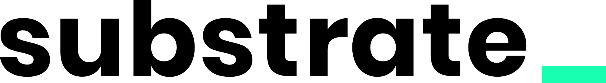

# Substrate Open Working Groups (SOWGs)


The Susbstrate Open Working Groups (SOWG) are community-based mechanisms to develop standards, specifications, implementations, guidlines or general initiatives in regards to the [Substrate framework](https://github.com/paritytech/substrate).
It could, but not restricted to, lead to new [Polkadot Standards Proposals](https://github.com/w3f/PSPs).
SOWG is meant as a place to find and track ongoing efforts and enable everybody with similar interests to join and contribute.

---

- [:clipboard: Process](#clipboard-process)
- [:pencil: Contributing](#pencil-contributing)
- [:bulb: Help](#bulb-help)

## :clipboard: Process  

Below is the workflow of the successful establishment of a new SOWG:
```
1. Draft -> 2. Activation -> 3. Maintain -> 4. Closed
```
1. **Draft:** A valid draft, based on the [Draft Template](./drafts/sowg-template.md) and has an open PR into the [root folder](/). 
2. **Activation:** Any SOWG template, merged into the root folder, based group which is in active discussions, has a defined champion and at least one contributer.
4. **Maintain:** The SOWG is actively maintained by the champion and it's contributers, in the sense of regular discussions, meetings, output.
4. **Closed:** The SOWG gets closed after inactivity for more than one quater or successful contribution to the [Polkadot Standards Proposals](https://github.com/w3f/PSPs), therefore the SOWG document will get moved into the [archive folder](/archive/).

In order to be **merged** for the different SOWG proposals, reviewers need to approve a PR. Reviewers should be known experts in the topic covered by the community. 

## :pencil: Contributing

Before you start writing a proposal for a new SOWG, you should discuss an idea in the various community channels (see the [Polkadot community website](https://polkadot.network/community/)). A SOWG should provide the motivation, the technical context as well as current contributors. 

1. Fork this repository.
2. In the newly created fork, create a copy of the [Draft Template](./drafts/sowg-template.md).
3. Fill out the [Draft Template](./drafts/sowg-template.md) with the details of your SOWG and move it to the [root folder](./) folder. If your SOWG requires images, the images should be integrated in the subdirectory of the [src folder](/src/), which has your SOWG number as the name.
4. Once you have completed the application, click on "create new pull request".
5. Rename the file with "number_of_oswg-oswg_name.md".
6. Update the pull request. 

## :bulb: Help

* [SOWG Channel on Riot](https://app.element.io/app)
